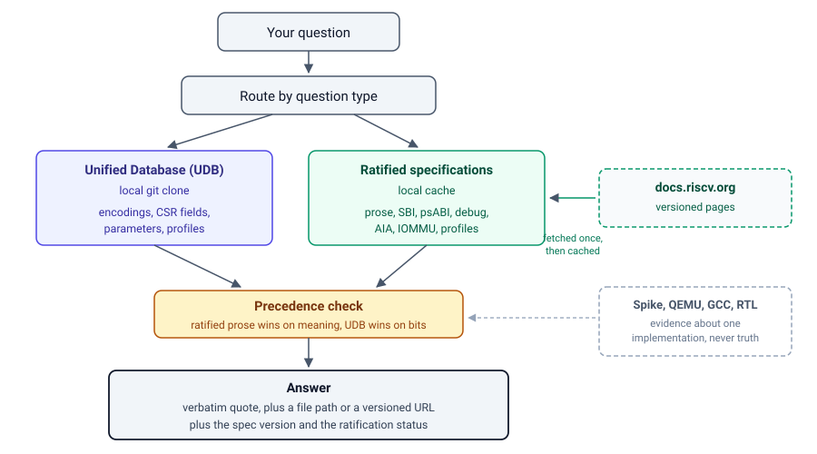

# Your LLM is confidently wrong about RISC-V. Here's the fix.

Ask your assistant one question:

> Is the Zalasr extension ratified?

Then check the answer against your own copy of the manual. If that copy is older than January 2026, it has no Zalasr chapter. Your toolchain probably rejects the name too. A careful assistant reads the manual, finds nothing, and tells you that Zalasr is not ratified.

That answer is wrong. RISC-V International ratified Zalasr in October 2025.

The assistant invented nothing. It read a real document and drew a fair conclusion from it. The document was simply not the right source. This is the shape of most wrong answers about RISC-V. The model is not careless. It reads one source when the question needs four.

I want to show you why that happens, and what a correct lookup process looks like. At the end I will show you a tool that does it, but the process matters more than the tool.

## RISC-V does not have one source of truth

Most of us say "check the spec" as if one file answers everything. In practice you use four sources, and each one is authoritative for something different.

**The ratified specifications** at [docs.riscv.org](https://docs.riscv.org) hold the normative text. Use them for meaning, for rules, and for compliance. The URL carries the version, so `/reference/sbi/v3.0/...` always means SBI 3.0.

**The Unified Database (UDB)** holds machine-readable data: instruction encodings, CSR bit layouts, field types, and parameters. Its encodings are validated against riscv-opcodes and LLVM. For a bit position, trust UDB over any prose table, because tables lose fidelity when a PDF becomes text.

**The non-ISA specifications** cover SBI, the psABI, debug, trace, IOMMU, AIA, PLIC, and the platform documents. UDB does not model these at all. Only docs.riscv.org answers them.

**The ratification records** close a gap the other three leave open. RISC-V ratifies an extension first and publishes it later. During that window the extension is genuinely ratified and genuinely missing from every manual. The Ratified Extensions wiki lists exactly those cases. Zalasr sat in that window.

Everything else is evidence, not truth. Spike, QEMU, GCC, LLVM, and your own RTL each describe one implementation. When a tool disagrees with the specification, the tool is the suspect.

## Three traps that produce confident errors

I hit all three while building this. Each one produces an answer that sounds authoritative and is wrong.

**A nightly tag is not a release.** The `riscv-isa-manual` repository publishes a release for every commit, named like `riscv-isa-release-<sha>-<date>`. That tag looks official. It is a nightly build, and it mixes ratified, frozen, and draft chapters in one document. The per-extension status lives in the preface status table, not in the file's presence. Read that table before you call anything ratified.

**Newest is not ratified.** docs.riscv.org may publish an older manual version than the newest nightly. That is correct behaviour, because the site publishes ratified milestones. A rule of "always use the latest" quietly selects draft text.

**Tools lag the specification.** Zalasr was ratified in October 2025. Today, `riscv-opcodes` still files it under `extensions/unratified/rv_zalasr`. If you read status from a toolchain, you inherit the toolchain's calendar rather than the standard's.

## The precedence ladder

Once you accept four sources, the ordering does the real work. This is the rule I settled on:

1. The ratified text at a pinned version URL.
2. The ratified index at `riscv.org/specifications/ratified/`.
3. The Ratified Extensions wiki, for the publication gap.
4. The manual's preface status table, for per-extension status.
5. UDB, for encodings, CSR layouts, and parameters.
6. Tools and hardware, as evidence only.

One rule runs the other way. For a bit position or an encoding, prefer UDB even over the prose, for the fidelity reason above.

You can apply this ladder by hand today, with no tooling. That alone will fix most wrong answers.

## Automating the ladder

I encoded this process as a Claude skill, so the routing happens on every question instead of only when I remember it.



The flow is small. The skill reads the question, decides which layer owns it, reads that source, applies the ladder, and answers with a citation. Encoding questions go to a local UDB clone. Wording, compliance, and non-ISA questions go to the ratified specifications. A specification that is not on disk is fetched once from docs.riscv.org and cached, so the second question about it costs no network.

The answer contract is the part I care about most. Every answer must quote the source text verbatim, give a file path or a versioned URL with a section anchor, name the specification version, and state whether the extension is ratified, frozen, or draft. You should never have to trust the model. You should be able to click the link.

## Setup

The repository is at [github.com/akifejaz/riscv-all-skill](https://github.com/akifejaz/riscv-all-skill).

```bash
git clone https://github.com/akifejaz/riscv-all-skill.git
cp -r riscv-all-skill/riscv-spec ~/.claude/skills/
```

That is enough for every specification question. The fetch script uses the Python standard library only, so there is nothing to install. Warm the cache for one specification if you want to try it offline:

```bash
python3 ~/.claude/skills/riscv-spec/scripts/riscv_docs.py fetch sbi --all
```

Add a UDB clone when you also want encodings and CSR field data:

```bash
git clone https://github.com/riscv/riscv-unified-db.git ~/riscv-unified-db
export UDB_ROOT=~/riscv-unified-db
```

The skill also works from Cursor or any client that reads `SKILL.md`.

## Talking to it

Ask in plain language. These are real prompts, and each one exercises a different layer.

```
Is Zalasr ratified? I can't find it in my ISA manual and my toolchain rejects it.
```

```
What is the exact encoding of czero.eqz, and is Zicond ratified?
```

```
Which integer registers are callee-saved in the standard RISC-V calling convention?
```

```
In the RISC-V IOMMU spec, what is the device directory table and how is it walked?
```

```
My RV64 core reads mstatus.SD as 0 while mstatus.FS is Dirty, and Spike agrees.
Is my core compliant?
```

That last one is the interesting case. The correct response does not accept your premise. It checks the rule, reads what Spike actually does, and points out that `SD` is bit 63 on RV64 and bit 31 on RV32. A test that masks `0x80000000` on RV64 reads a reserved bit that is always zero. The specification is the reference, and the tools are the suspects.

### What an answer looks like

For the Zalasr question, the reply states the status first, then proves it:

> **Ratified.** Version 1.0.0, ratification date 2025-10.
>
> Published chapter: `docs.riscv.org/reference/isa/v20260120/unpriv/zalasr.html`
> Preface status table, `src/unpriv/preface.adoc:167`: `|*Zalasr* |*1.0* |*Ratified*`
> UDB `spec/std/isa/ext/Zalasr.yaml`: `state: ratified`, `ratification_date: 2025-10`
>
> One source disagrees. `riscv-opcodes` still files Zalasr under `extensions/unratified/`. The tool lags the standard.

Three sources agree. The one that disagrees gets named instead of quietly dropped. You can check every line of that in under a minute, which is the point.

Judge each answer on two things. Does it carry a versioned URL or a file path? Does it state the specification version and the status? An answer without those is the failure this whole process exists to prevent.

## What it will not do

I want to be plain about the limits, because a tool that claims authority has to earn it.

The source data can be wrong. In July 2026 UDB listed the Q extension as version 1.0.0 when the ratified version is 2.2.0, reported as issue #2068. The maintainers fixed it in six days, which says good things about the project. It also proves that a citation can be confidently wrong. The precedence ladder helps here, because status questions go to the ratified sources before UDB, but no ladder removes the risk completely.

The skill is unofficial and not affiliated with RISC-V International. UDB describes its own generated specifications as unofficial, and I keep that label.

The UDB layer covers the ISA only. Vendor errata, board bring-up, and toolchain bugs sit outside all of these sources. When a question falls outside, the honest answer names a better source instead of guessing.

## A question for the UDB community

While building this I noticed something small and fixable. UDB records `state: ratified` and a ratification date on its extension files. That is exactly the field engineers keep asking about in issue trackers, in questions like "Is Ssccptr a ratified extension?" and "Is Zhinxmin not yet ratified?".

UDB also ships an MCP server at `tools/mcp_gen_server/server.py`. It searches instructions, CSRs, and extensions well. It does not expose ratification status, profiles, or the manual prose. A grep of that file for `ratif`, `frozen`, `profile`, and `state` returns nothing.

Surfacing those fields would answer the most common question directly from the database, with no extra tooling. I would be glad to help with that if the UnifiedDB SIG thinks it is worth doing.

If you try the skill, I want to hear where it gets things wrong. Wrong answers are more useful to me than stars. Open an issue with the question you asked and the answer you expected, and I will look at whether the routing or the ladder was at fault.
